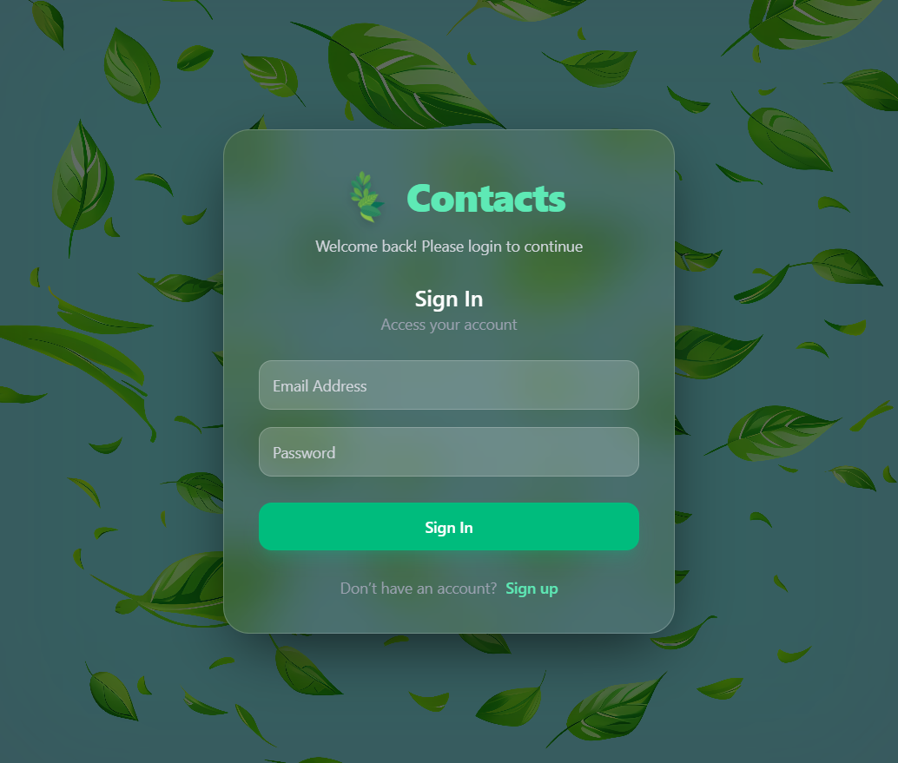
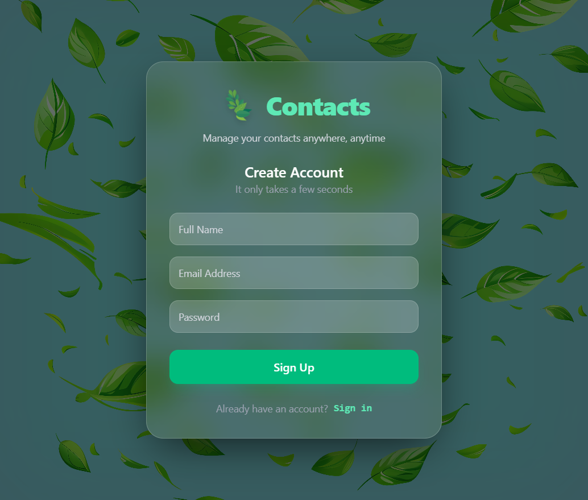

# 📇 Contacts — MERN Stack Contact Manager

> **Developer:** Saleh Muhammad Mangrio

> A modern, secure, and fully responsive contact management application built with the MERN stack.

---


---

## ✨ Features

* 🔐 **Secure Authentication** — User registration and login with JWT tokens and bcrypt password hashing
* 📇 **Full Contact Management** — Create, view, update, and delete contacts
* 🛡️ **Protected Routes** — Only authenticated users can access private pages
* ✅ **Robust Validation** — Client-side and server-side validation using Yup
* 🖼️ **Profile Pictures** — Optional contact profile image support with fallback initials
* 🎨 **Modern Glassmorphism UI** — Elegant frosted-glass design with emerald accents
* ⚡ **Smooth Animations** — Powered by Framer Motion for polished interactions
* 📱 **Responsive Design** — Optimized for mobile, tablet, and desktop devices
* ☁️ **Cloud Storage** — Securely stores data using MongoDB Atlas

---

## 🛠️ Tech Stack

### Frontend

* **React** – Component-based UI library
* **Vite** – Fast development server and build tool
* **Tailwind CSS** – Utility-first styling framework
* **React Router** – Client-side routing
* **Framer Motion** – Animations and transitions
* **Axios** – API communication
* **Yup** – Form validation

### Backend

* **Node.js** – JavaScript runtime
* **Express.js** – REST API framework
* **MongoDB** – NoSQL database
* **Mongoose** – MongoDB object modeling
* **JWT** – Authentication tokens
* **bcryptjs** – Password hashing
* **CORS** – Cross-origin resource sharing
* **dotenv** – Environment variable management

---

## 📸 Screenshots

| Login Page          | Register Page             |
| ------------------- | ------------------------- |
|  |  |

> Additional screens include Landing Page, All Contacts, Create Contact, View Contact, and Edit Contact, all designed with a consistent emerald glassmorphism theme.

---

## 📁 Complete Project Structure

```bash
contact/
├── README.md
├── login.png
├── register.png
│
├── backend/
│   ├── package.json
│   ├── package-lock.json
│   └── src/
│       ├── server.js
│       ├── app.js
│       ├── config/
│       │   └── db.js
│       ├── controller/
│       │   ├── userController.js
│       │   └── contactController.js
│       ├── middlewares/
│       │   ├── authMiddleware.js
│       │   └── userMiddlewares.js
│       ├── models/
│       │   ├── userModel.js
│       │   └── contactModel.js
│       ├── routes/
│       │   ├── userRoute.js
│       │   └── contactRoutes.js
│       ├── services/
│       │   ├── userServices.js
│       │   └── contactServices.js
│       ├── utils/
│       │   └── token.js
│       └── validations/
│           ├── userValidation.js
│           └── contactValidation.js
│
└── frontend/
    ├── package.json
    ├── package-lock.json
    ├── index.html
    ├── vite.config.js
    ├── eslint.config.js
    └── src/
        ├── main.jsx
        ├── App.jsx
        ├── global.css
        ├── AnimateRoutes.jsx
        ├── assets/
        │   ├── logo.gif
        │   └── leaf.png
        ├── components/
        │   ├── Navbar.jsx
        │   ├── ProtectedRoutes.jsx
        │   └── ConfirmModal.jsx
        ├── pages/
        │   ├── Home/
        │   │   └── LandingPage.jsx
        │   ├── auth/
        │   │   ├── Login.jsx
        │   │   └── Register.jsx
        │   └── contact/
        │       ├── AllContacts.jsx
        │       ├── CreateContact.jsx
        │       ├── ViewContact.jsx
        │       └── EditContact.jsx
        └── utils/
            └── api.js
```

---

## 🚀 Getting Started

### Prerequisites

* Node.js (v18 or later)
* npm or yarn
* MongoDB Atlas account or local MongoDB instance
* Git

### 1. Clone the Repository

```bash
git clone https://github.com/salehmangrio/Contact.git
cd contact
```

### 2. Install Backend Dependencies

```bash
cd backend
npm install
```

Create a `.env` file inside the `backend` folder:

```env
PORT=5000
MONGODB_URI=your_mongodb_connection_string
JWT_SECRET=your_super_secret_key
FRONTEND_URL=http://localhost:5173
```

Start the backend server:

```bash
npm run dev
```

### 3. Install Frontend Dependencies

```bash
cd ../frontend
npm install
```

Create a `.env` file inside the `frontend` folder:

```env
VITE_SERVER_URL=http://localhost:5000/api
```

Start the frontend development server:

```bash
npm run dev
```

---

## 🔌 API Endpoints

### Authentication

| Method | Endpoint             | Description            |
| ------ | -------------------- | ---------------------- |
| POST   | `/api/user/register` | Register a new user    |
| POST   | `/api/user/login`    | Login an existing user |

### Contacts

| Method | Endpoint            | Description          |
| ------ | ------------------- | -------------------- |
| GET    | `/api/contacts`     | Get all contacts     |
| POST   | `/api/contacts`     | Create a new contact |
| PUT    | `/api/contacts/:id` | Update a contact     |
| DELETE | `/api/contacts/:id` | Delete a contact     |

> All contact routes require a valid JWT Bearer token.

---

## 🔐 Environment Variables

### Backend

```env
PORT=5000
MONGODB_URI=your_mongodb_uri
JWT_SECRET=your_jwt_secret
FRONTEND_URL=http://localhost:5173
```

### Frontend

```env
VITE_SERVER_URL=http://localhost:5000/api
```

---

## 🎨 UI Highlights

* Glassmorphism cards with backdrop blur
* Emerald green accent color palette
* Smooth hover and page transition animations
* Fully responsive layout
* Clean and intuitive user experience

---

## 🧪 Validation Rules

### User Registration

* Name: Minimum 5 characters
* Email: Valid email format
* Password: Minimum 8 characters

### Contact Creation

* Name: 2–50 characters
* Contact Number: 10–15 digits
* Profile URL: Optional, must be a valid URL

---

## 📜 Available Scripts

### Backend

```bash
npm run dev    # Start development server with nodemon
npm start      # Start production server
```

### Frontend

```bash
npm run dev      # Start Vite development server
npm run build    # Build for production
npm run preview  # Preview production build
npm run lint     # Run ESLint
```

---

## 🌟 Future Enhancements

* 🔍 Contact search and filtering
* 📄 Pagination for large contact lists
* 📤 Import and export contacts (CSV/vCard)
* 🌙 Dark and light mode toggle
* ✉️ Email verification
* 🔑 Password reset functionality
* 🏷️ Contact categories and tags
* 🔄 Real-time synchronization

---

## 🤝 Contributing

Contributions, issues, and feature requests are welcome.

1. Fork the repository
2. Create your feature branch (`git checkout -b feature/amazing-feature`)
3. Commit your changes (`git commit -m 'Add amazing feature'`)
4. Push to the branch (`git push origin feature/amazing-feature`)
5. Open a Pull Request

---

## 🎓 What I Learned

- Building secure JWT authentication systems
- Structuring scalable MERN applications
- Implementing protected routes and middleware
- Designing responsive glassmorphism interfaces
- Managing state and API communication effectively

---

## 📄 License

This project is licensed under the ISC License.

---

## 👨‍💻 Author

**Saleh Muhammad Mangrio**

* GitHub: [https://github.com/salehmangrio](https://github.com/salehmangrio)
* LinkedIn: [https://linkedin.com/in/salehmuhammad114](https://linkedin.com/in/salehmuhammad114)

---

<p align="center">
  Built with ❤️ using the MERN Stack
</p>
